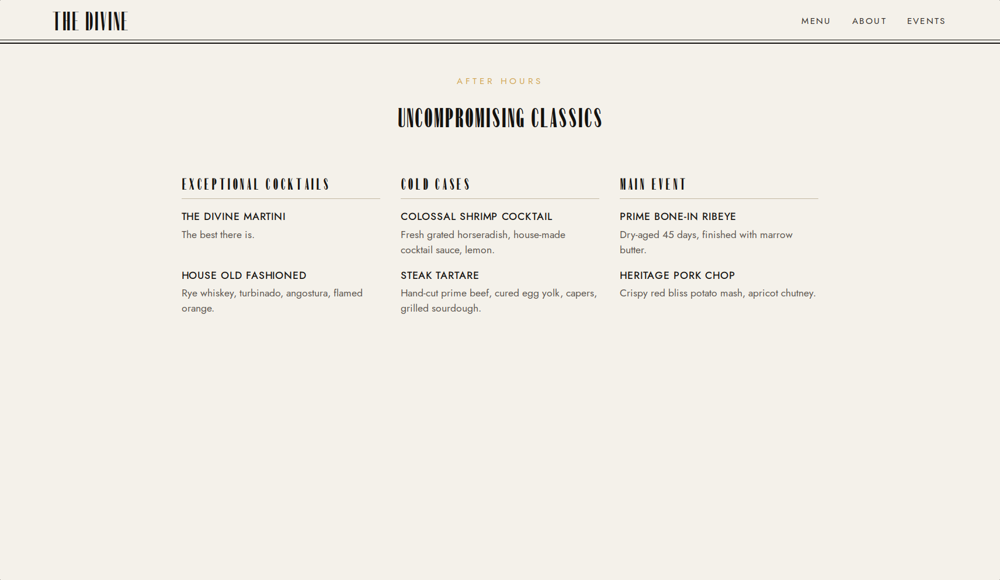
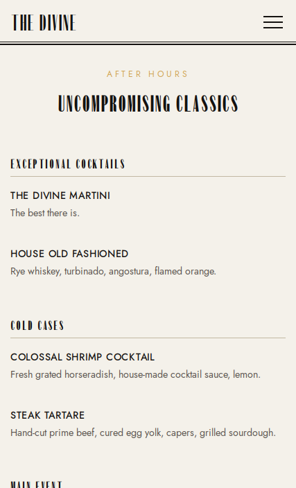

# The Divine

A responsive art-deco aesthetic restaurant page showcase built with Webpack.





<!-- TOC -->

## Table of Contents

- [Preview](#preview)
- [Features](#features)
- [Developer's note](#developers-note)
- [Acknowledgments](#acknowledgments)
- [License](#license)

<!-- /TOC -->

## Preview

[View Live Demo](https://calsjunior.github.io/the-divine/)

## Features

- Responsive navbar layout on mobile with slick animation.
- Fluid spacing, sizing, and typography using `clamp` via the script in
  `./scripts/clamp.sh`
- Modern CSS approach with nesting, pseudo-private properties, and semantic tokens.

## Structure

```
├── public
│   └── fonts      # Fonts
├── scripts
│   └── clamp.sh   # Script to get perfect clamp values
├── src
│   ├── components # Reusable parts of the website
│   ├── data       # Data to populate the menu
│   ├── pages      # All pages in the website
│   ├── styles     # Global styling and reset
│   ├── utils      # DOM function to create elements
```

## Developer's note

The project was made to learn and utilize the [webpack
bundler](https://webpack.js.org/), but along the way I taught myself how to
create HTML DOM using javascript with a function similar to that of React. Also,
I have gained the knowledge of how to structure a website, how to style, how to
make them responsive, and how to apply more modern css solutions including
semantic tokens, nesting, and block/inline properties.

## Acknowledgments

This project was completed as a part of [The Odin Project's](https://www.theodinproject.com/) JavaScript curriculum.

## License

[MIT (c) Calsjunior](LICENSE)
